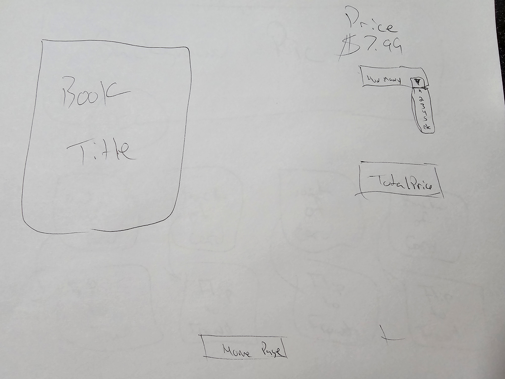

# Portfolio

---

This is a website showing my progress from the very first day I decided to enter the Full Stack Developer Bootcamp

# About

---

This capstone will showcase some insight about what I've learned so far in my first cohort. I will be implementing a for-loop, if-else statement, tables, row, and columns building up the pages with bootstrap. Also building a flip card showing my current and future career plans. I have a portfolio page with screenshots showing my projects. There will also a short story about me with the option to purchase my biography and other materials. When you are ready to check out it will take you to a purchase form. That is not complete, but during the next cohort we will learn more about it.

# Roadmap

---

[x] flip card [x] book checkout
[x] html [x] picture overlay opacity
[x] javascript [x] add to cart
[x] bootstrap
[x] css

# Wirefram

# Contact

---

Author: Louis Perkins -laperkins2@yahoo.com

# Acknowledgements

---

-Robert McCreary Mannino- Instructor

- https://getbootstrap.com/docs/5.3/layout/grid/#example
-
-
-
